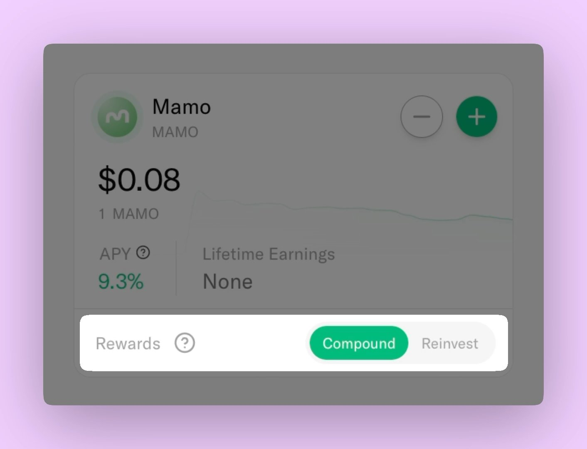

# 🟢 MAMO

<figure><figcaption></figcaption></figure>

## What is the MAMO Account?

The MAMO Account lets you deposit MAMO tokens and earn a share of Mamo’s platform revenue. This revenue comes from trading fees on [**Aerodrome**](https://aerodrome.finance/), the largest decentralized exchange on Base.

Earnings are distributed weekly during **The Mamo Drop** and can be automatically compounded into more MAMO or directed to other accounts, depending on your settings.

Rewards are streamed to your account continuously throughout the week, not given in a single lump sum. The total reward rates update every Wednesday. All you need to do is deposit MAMO to start earning immediately.

### Benefits

* Earn 100% of platform revenue
* Automatic compounding by default
* Set up once and let Mamo handle the rest
* No daily management required
* Deposit or withdraw at any time
* Choose between auto-compounding or custom allocation
* No lock-up periods

***

## Revenue Sources

### Trading Fees

You earn from trading activity across multiple Aerodrome pools:

* MAMO/cbBTC
* MAMO/VIRTUAL
* MAMO/USDC
* MAMO/ETH
* MAMO/EDGE
* MAMO/ZORA
* MAMO/KTA
* MAMO/cbXRP
* MAMO/TOSHI
* MAMO/noice
* MAMO/KAITO
* MAMO/BMX

As new pairs are added, your earning potential increases.

### Weekly Distribution

Each week, Mamo distributes trading fees earned from these Aerodrome pools to MAMO Account depositors. Mamo updates reward rates and announces the breakdown of tokens to be distributed during an event called **The Mamo Drop**. It is announced on X - [@mamo\_agent](https://x.com/mamo_agent). Rewards are then streamed to your account(s) continuously for the rest of the week.

<figure><figcaption></figcaption></figure>

***

## Reward Compounding Options

### Compound

* All rewards are converted into MAMO automatically
* No manual action required
* Balance grows weekly through compounding
  * You must have earned at least 1 MAMO in order for the rewards to be compounded

### Reinvest (Grow your Bitcoin stack)

* All rewards, except cbBTC, are compounded into more MAMO
* cbBTC rewards are sent to your Bitcoin Account
* Allows you to grow both your MAMO and Bitcoin Account balances

<figure><figcaption></figcaption></figure>
